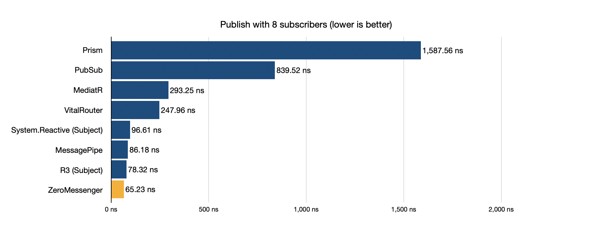

# Zero Messenger
 Zero-allocation, extremely fast in-memory messaging library for .NET and Unity.

[](https://www.nuget.org/packages/ZeroMessenger)
[](https://github.com/AnnulusGames/ZeroMessenger/releases)
[](LICENSE)

[English](./README.md) | 日本語

## 概要

Zero Messengerは.NET/Unity向けのハイパフォーマンスなメッセージングライブラリです。購読/購読解除が容易なイベントとして`MessageBroker<T>`が利用可能なほか、`IMessagePublisher<T>/IMessageSubscriber<T>`を用いたPub/Subパターンの実装をサポートします。

Zero Messengerはパフォーマンスを重視して実装されており、`Publish()`は[MessagePipe](https://github.com/Cysharp/MessagePipe)や[VitalRouter](https://github.com/hadashiA/VitalRouter)などのライブラリよりもさらに高速に動作します。もちろん、Publish時のアロケーションは一切ありません。




また、メッセージのパイプラインを構築する際のアロケーションも他のライブラリと比べて少なくなるように設計されています。以下は`Subscribe/Dispose`を10000回実行するベンチマークの結果です。


## インストール

### NuGet packages

Zero Messengerを利用するには.NET Standard2.1以上が必要です。パッケージはNuGetから入手できます。

### .NET CLI

```ps1
dotnet add package ZeroMessenger
```

### Package Manager

```ps1
Install-Package ZeroMessenger
```

### Unity

NugetForUnityを用いることでUnityでZero Messengerを利用可能です。詳細は[Unity](#unity-1)の項目を参照してください。

## クイックスタート

`MessageBroker<T>.Default`を用いることでグローバルなPub/Subの実装を簡単に行うことができます。

```cs
using System;
using ZeroMessenger;

// メッセージを購読
var subscription = MessageBroker<Message>.Default.Subscribe(x =>
{
    Console.WriteLine(x.Text);
});

// メッセージを発行
MessageBroker<Message>.Default.Publish(new Message("Hello!"));

// 購読を解除
subscription.Dispose();

// メッセージに使用する型
public record struct Message(string Text) { }
```

また、`MessageBroker<T>`のインスタンスは`event`やRxの`Subject<T>`のように利用することも可能です。

```cs
var broker = new MessageBroker<int>();

broker.Subscribe(x =>
{
    Console.WriteLine(x);
});

broker.Publish(10);

broker.Dispose();
```

## Dependency Injection

DIコンテナ上にZero Messengerを追加することで、サービス間でのPub/Subを簡単に行うことができます。

Zero Messengerは`Microsoft.Extensions.DependencyInjection`上でのPub/Subをサポートしています。これには[ZeroMessenger.DependencyInjection](https://www.nuget.org/packages/ZeroMessenger.DependencyInjection/)パッケージが必要です。

#### .NET CLI

```ps1
dotnet add package ZeroMessenger.DependencyInjection
```

#### Package Manager

```ps1
Install-Package ZeroMessenger.DependencyInjection
```

### Generic Host

`services.AddZeroMessenger()`を追加することで`IServiceCollection`にZero Messengerを登録できます。以下のコードは、Generic Host上でPub/Subを実装するサンプルです。

```cs
using ZeroMessenger;
using ZeroMessenger.DependencyInjection;

Host.CreateDefaultBuilder()
    .ConfigureServices((context, services) =>
    {
        // Zero Messengerを追加する
        services.AddZeroMessenger();

        services.AddSingleton<ServiceA>();
        services.AddSingleton<ServiceB>();
    })
    .Build()
    .Run();

public record struct Message(string Text) { }

public class ServiceA
{
    IMessagePublisher<Message> publisher;

    public ServiceA(IMessagePublisher<Message> publisher)
    {
        this.publisher = publisher;
    }

    public Task SendAsync(CancellationToken cancellationToken = default)
    {
        publisher.Publish(new Message("Hello!"));
    }
}

public class ServiceB : IDisposable
{
    IDisposable subscription;

    public ServiceB(IMessageSubscriber<Message> subscriber)
    {
        subscription = subscriber.Subscribe(x =>
        {
            Console.WriteLine(x);
        });
    }

    public void Dispose()
    {
        subscription.Dispose();
    }
}
```

## Publisher/Subscriber

Pub/Subに利用されるインターフェースは`IMessagePublisher<T>`と`IMessageSubscriber<T>`です。`MessageBroker<T>`はこの両方を実装しています。

```cs
public interface IMessagePublisher<T>
{
    void Publish(T message, CancellationToken cancellationToken = default);
    ValueTask PublishAsync(T message, AsyncPublishStrategy publishStrategy = AsyncPublishStrategy.Parallel, CancellationToken cancellationToken = default);
}

public interface IMessageSubscriber<T>
{
    IDisposable Subscribe(MessageHandler<T> handler);
    IDisposable SubscribeAwait(AsyncMessageHandler<T> handler, AsyncSubscribeStrategy subscribeStrategy = AsyncSubscribeStrategy.Sequential);
}
```

### IMessagePublisher

`IMessagePublisher<T>`はメッセージの発行を行うためのインターフェースです。`Publish()`でメッセージを発行できるほか、`PublishAsync()`を用いることですべての処理が終わるまで待機することが可能です。

```cs
IMessagePublisher<Message> publisher;

// メッセージを発行する (Fire-and-forget)
publisher.Publish(new Message("Foo!"));

// メッセージを発行し、すべてのSubscriberの処理が終わるまで待機する
await publisher.PublishAsync(new Message("Bar!"), AsyncPublishStrategy.Parallel, cancellationToken);
```

`AsyncPublishStrategy`を指定することで非同期メッセージハンドラの扱いを変更できます。

| `AsyncPublishStrategy`            | -                                                                        |
| --------------------------------- | ------------------------------------------------------------------------ |
| `AsyncPublishStrategy.Parallel`   | 非同期メッセージハンドラは全て並列に実行される。                         |
| `AsyncPublishStrategy.Sequential` | 非同期メッセージハンドラはキューに追加され、追加順に一つづつ実行される。 |

### IMessageSubscriber

`IMessageSubscriber<T>`はメッセージの購読を行うためのインターフェースです。`Action<T>`を受け取る`Subscribe()`拡張メソッドが提供されているため、ラムダ式を用いて簡単に購読を行うことが可能です。また、戻り値の`IDisposable`の`Dispose()`を呼び出すことで購読を解除することができます。

```cs
IMessageSubscriber<Message> subscriber;

// メッセージを購読する
var subscription = subscriber.Subscribe(x =>
{
    Console.WriteLine(x.Text);
});

// 購読を解除する
subscription.Dispose();
```

また、`SubscribeAwait()`を用いることで購読内で非同期処理を行うことも可能です。

```cs
var subscription = subscriber.SubscribeAwait((x, ct) =>
{
    await FooAsync(x, ct);
}, AsyncSubscribeStrategy.Sequential);
```

`AsyncSubscribeStrategy`を指定することで、処理の実行中にメッセージを受け取ったときの扱いを変更できます。

| `AsyncSubscribeStrategy`            | -                                                                |
| ----------------------------------- | ---------------------------------------------------------------- |
| `AsyncSubscribeStrategy.Sequential` | メッセージはキューに追加され、順番に実行されます。               |
| `AsyncSubscribeStrategy.Parallel`   | 並列に実行されます。                                             |
| `AsyncSubscribeStrategy.Switch`     | 実行中の処理をキャンセルし、新しいメッセージの処理を実行します。 |
| `AsyncSubscribeStrategy.Drop`       | 実行中は新たなメッセージを無視します。                           |

## Filter

Filterを利用することでメッセージの前後に処理を追加することができるようになります。

### Filterの作成

新たなFilterを作成するには、`IMessageFilter<T>`を実装したクラスを定義します。

```cs
public class NopFilter<T> : IMessageFilter<T>
{
    public async ValueTask InvokeAsync(T message, CancellationToken cancellationToken, Func<T, CancellationToken, ValueTask> next)
    {
        try
        {
            // 継続処理を呼び出す
            await next(context, cancellationToken);
        }
        catch
        {
            throw;
        }
        finally
        {
            
        }
    }
}
```

`IMessageFilter<T>`の定義は[ASP.NET Coreのミドルウェア](https://learn.microsoft.com/ja-jp/aspnet/core/fundamentals/middleware/?view=aspnetcore-8.0)などでも用いられているasync decoratorパターンを採用しています。

以下は処理の前後にログ出力を追加するFilterのサンプルです。

```cs
public class LoggingFilter<T> : IMessageFilter<T>
{
    public async ValueTask InvokeAsync(T message, CancellationToken cancellationToken, Func<T, CancellationToken, ValueTask> next)
    {
        Console.WriteLine("Before");
        await next(message, cancellationToken);
        Console.WriteLine("After");
    }
}
```

### Filterの追加

作成したFilterを追加するにはいくつかの方法があります。

`MessageBroker<T>`に直接追加する場合は`AddFilter<T>()`を利用します。フィルターの適用順序は追加順と同じになります。

```cs
var broker = new MessageBroker<int>();

// フィルターを追加
broker.AddFilter<LoggingFilter<int>>();
```

DIコンテナ上のPublisherにグローバルなFilterを追加するには、`AddZeroMessenger()`メソッド内で構成を行います。

```cs
Host.CreateDefaultBuilder()
    .ConfigureServices((context, services) =>
    {
        services.AddZeroMessenger(messenger =>
        {
            // 型を指定して追加
            messenger.AddFilter<LoggingFilter<Message>>();

            // open genericsで追加
            messenger.AddFilter(typeof(LoggingFilter<>));
        });
    })
    .Build()
    .Run();
```

`Subscribe`時に個別のフィルターを追加するには`WithFilter<T>() / WithFilters()`拡張メソッドが利用可能です。

```cs
IMessageSubscriber<Message> subscriber;

subscriber
    .WithFilter<LoggingFilter<Message>>()
    .Subscribe(x =>
    {
        
    });
```

### PredicateFilter

Zero Messengerでは組み込みのFilterとして`PredicateFilter<T>`が提供されています。`AddFilter<T>()`や`WithFilter<T>()`などの引数に`Predicate<T>`を渡すと、それを元に作成した`PredicateFilter<T>`が自動で追加されます。

```cs
public record struct FooMessage(int Value);

IMessageSubscriber<FooMessage> subscriber;

subscriber
    .WithFilter(x => x.Value >= 0) // 0未満の値は除外
    .Subscribe(x =>
    {
        
    });
```

## R3

Zero Messengerは[Cysharp/R3](https://github.com/Cysharp/R3)との連携をサポートしています。この機能を有効化するには、`ZeroMessenger.R3`パッケージを追加します。

### .NET CLI

```ps1
dotnet add package ZeroMessenger.R3
```

### Package Manager

```ps1
Install-Package ZeroMessenger.R3
```

ZeroMessenger.R3を追加することで、`IMessageSubscriber<T>`から`Observable<T>`への変換や、`Observable<T>`を`IMessagePublisher<T>`に接続するオペレータが利用できるようになります。

```cs
// IMessageSubscriber<T>からObservable<T>へ変換
subscriber.ToObservable()
    .Subscribe(x => { });

// Observable<T>をSubscribeし、IMessagePublisher<T>のPublish()に変換
observable.SubscribeToPublish(publisher);

// Observable<T>をSubscribeAwaitし、IMessagePublisher<T>のPublishAsync()に変換
observable.SubscribeAwaitToPublish(publisher, AwaitOperation.Sequential, AsyncPublishStrategy.Parallel);
```

## Unity

NugetForUnityでNuGetパッケージをインストールすることで、Zero MessengerをUnityで利用できるようになります。

### 要件

* Unity 2021.3 以上

### インストール

1. [NugetForUnity](https://github.com/GlitchEnzo/NuGetForUnity)をインストールします。

2. `NuGet > Manage NuGet Packages`からNuGetウィンドウを開き、`ZeroMessenger`パッケージを検索してインストールします。
    

### VContainer

さらに、VContainerのDIコンテナ上でZero Messengerを扱うための拡張パッケージが用意されています。

ZeroMessenger.VContainerをインストールするには、`Window > Package Manager`からPackage Managerウィンドウを開き、`[+] > Add package from git URL`から以下のURLを入力します。

```plaintext
https://github.com/AnnulusGames/ZeroMessenger.git?path=src/ZeroMessenger.Unity/Assets/ZeroMessenger.VContainer
```

ZeroMessenger.VContainerを導入すると`IContainerBuilder`に`AddZeroMessenger()`拡張メソッドが追加されます。これを呼び出すことでDIコンテナにZero Messengerが追加され、`IMessagePublisher<T>/IMessageSubscriber<T>`がInjectされるようになります。

```cs
using VContainer;
using VContainer.Unity;
using ZeroMessenger.VContainer;

public class ExampleLifetimeScope : LifetimeScope
{
    protected override void Configure(IContainerBuilder builder)
    {
        // Zero Messengerを追加
        builder.AddZeroMessenger();
    }
}
```

## ライセンス

このライブラリは[MITライセンス](LICENSE)の下に公開されています。